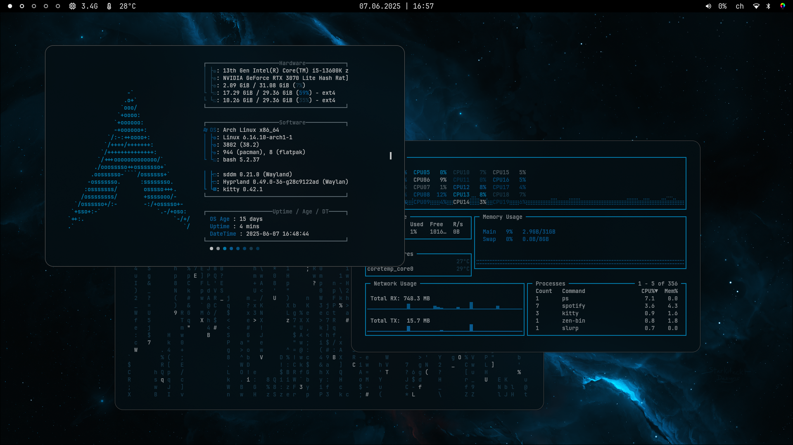
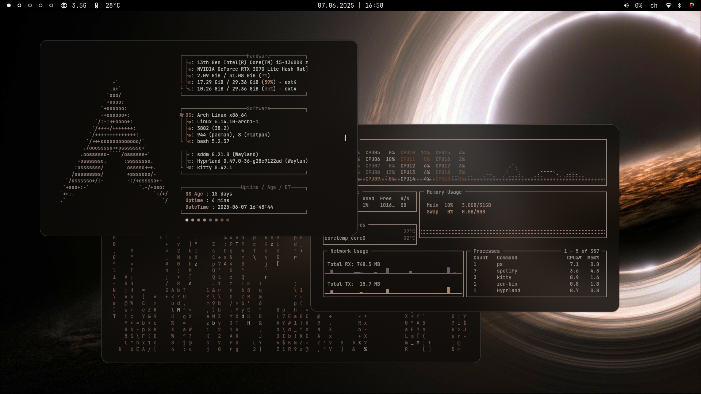
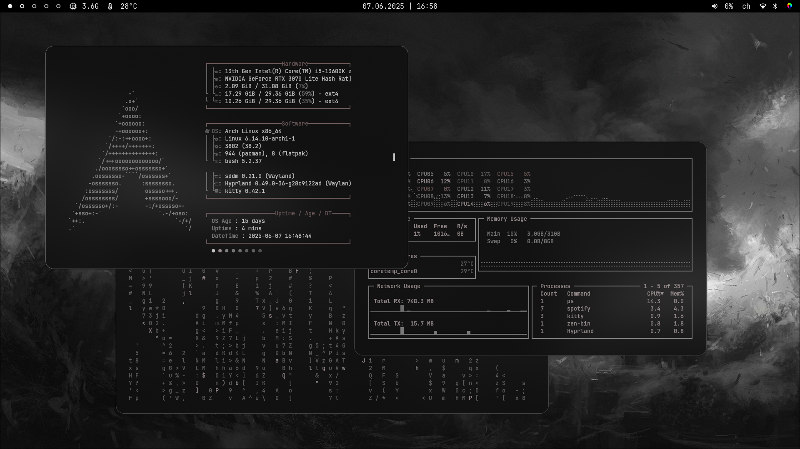
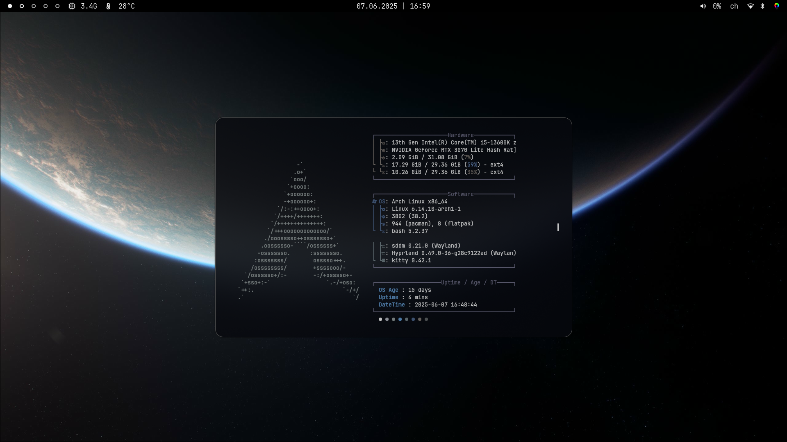
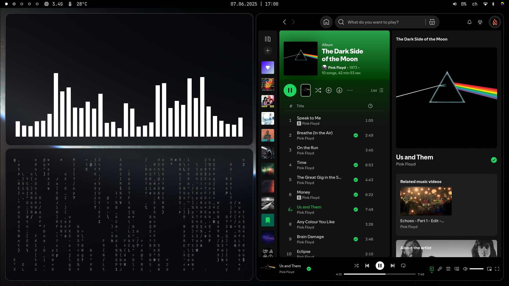

# ✨ Hyprland Dotfiles 🌿


[](https://github.com/JaKooLit/Hyprland-Dots/blob/main/README.md)
[](https://github.com/JaKooLit/Hyprland-Dots/blob/main/i18n/README.uk.md)

---

## About

Welcome to my **Hyprland Dotfiles** repository — a personal Arch Linux rice configuration for the Hyprland window manager! This repo contains configs for various tools and apps that I use to customize my desktop experience.

> ⚠️ **Note:** This is my first rice setup. It’s a work-in-progress and not fully polished yet, but I’m happy with the current results!  
> You’ll find configurations for: Hyprland, Waybar, Kitty, Mako, Rofi, eww, swaync, Wofi, and more.

---

## 📸 Screenshots 

Check out some screenshots of my rice below! Click any image to view it full size.

> Those screenshots were taken before I updated the waybar so the one in the config files isn't the one displayed here. I will update the screenshots ^^

<div align="center">

[](screenshots/screenshot1.png) 

</div>

<p align="center">
  
  
  
  
</p>

---

## 💡 How does it work ? 

### Keybinds
- You'll find all keybinds in `.config/hypr/configs/Keybinds.conf` and `hypr/UserConfigs/UserKeybinds`

Useful shortcuts :
```plaintext
SUPER + ENTER : open the default terminal (kitty)
SUPER + Q : close active window
```
Special ones :
```plaintext
SUPER + SHIFT + Q : open rofi shutdown options menu
SUPER + D : open app launcher
SUPER + N : open notifications center
SUPER + SHIFT + W : run the wallpaper.sh script to choose a wallpaper
```

### Customizing
- You can change default apps (terminal, file explorer, ...) in `.config/hypr/UserConfigs/UserDefaults.conf`

- Hyprland theming settings (opacity, color, blur, rouding) are in `.config/hypr/theme/custom/theme.conf`

- Terminal theming settings are in `.config/kitty/kitty.conf` and `current-theme.conf`

- Waybar settings are in `.config/waybar/config.jsonc` and `style.css`

---

## 🚀 Installation 

To use this rice on your Arch Linux + Hyprland setup:

1. **Clone this repo:**

```bash
git clone https://github.com/Sabu8c/hyprland-dotfiles.git ~/.config
```

2. **Backup your current configs** (just in case!):

```bash
mv ~/.config ~/.config_backup
```

3. **Copy files/folders you want from this repo into your `~/.config`:**

```bash
cp -r ~/.config/hyprland-dotfiles/waybar ~/.config/
cp -r ~/.config/hyprland-dotfiles/hypr ~/.config/
```
Add more as needed


4. **Restart Hyprland** or your session to apply changes.

---

## 🤝 Credits

Some config files were taken from others personal dotfiles and modified. I will try finding their github in order to tag them here (I forgot them ^^)

---
## 🛠️ Config Sections & Credits 

<details>  
  <summary><strong>Hyprland</strong></summary>

Configuration files for the Hyprland window manager — the core of this rice setup.
- Original Author: [Hyprland GitHub](https://github.com/hyprwm/Hyprland)  

</details>


<details>  
  <summary><strong>Waybar</strong></summary>

Custom Waybar setup for a sleek and functional status bar.
- Original Author: [Waybar GitHub](https://github.com/Alexays/Waybar)  

</details>


<details>  
  <summary><strong>Kitty</strong></summary>

Terminal emulator configuration for Kitty.
- Original Author: [Kitty GitHub](https://github.com/kovidgoyal/kitty)  

</details>


<details>  
  <summary><strong>Mako</strong></summary>

Notification daemon configuration.
- Original Author: [Mako GitHub](https://github.com/emersion/mako)  

</details>


<details>  
  <summary><strong>Rofi</strong></summary>

Application launcher configuration.
- Original Author: [Rofi GitHub](https://github.com/davatorium/rofi)  

</details>


<details>  
  <summary><strong>Eww</strong></summary>

Widget system configuration for Eww.
- Original Author: [Eww GitHub](https://github.com/elkowar/eww)  

</details>


<details>  
  <summary><strong>Swaync</strong></summary>

Music player client configuration for Swaync.
- Original Author: [Swaync GitHub](https://github.com/jpsutton/swaync)  

</details>


<details>  
  <summary><strong>Wofi</strong></summary>

Wayland-native application launcher.
- Original Author: [Wofi GitHub](https://git.sr.ht/~sircmpwn/wofi)  

</details>

---

Thanks for checking out my rice! Feel free to open issues or PRs to contribute or report bugs.

---

*Made with ❤️ by Sabu8c*
